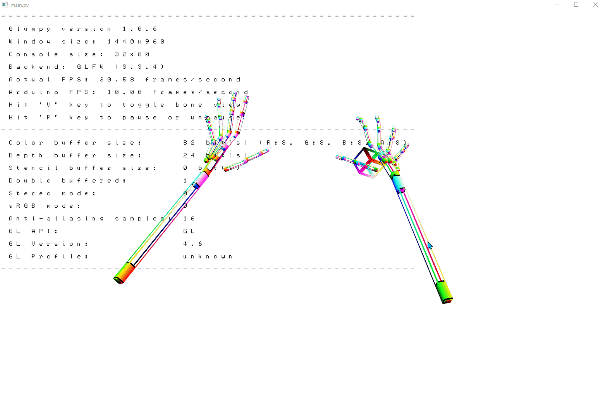
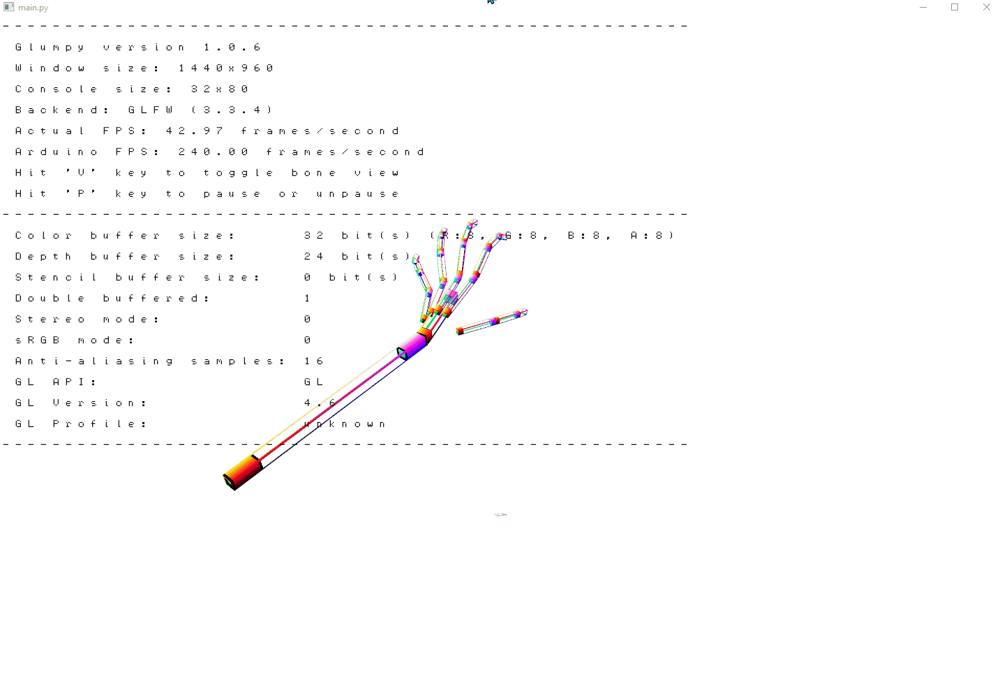

## 遇到的问题以及解决方法

### 舵机与电机的控制电路冲突问题

#### 问题具体描述

- 当我们将小车与机械臂完全组装好后，同时开启两项功能，发现只有机械臂能正确解析相关手势

    而小车动力来源（电机）失去线性变化的电压（即变速功能）

    - 相对于`digitalWrite()`，
    - PWM是通过周期性调整某个针脚的电压提供变电压功能的机制，可在只支持二值输入的针脚上模拟其他中间电压值
    - 周期性调整电压便需要Arduino本身的硬件计时器的支持，因此每一个PWM针脚都会被分配一个固定的timer用以实现`analogWrite()`功能

- Arduino Uno只有3个可处理中断用的timer（计时器）

    - `timer0`，8位，用以处理主程序体：`loop()`以及`delay()`，`millis()`
    - `timer1`，16位，是舵机（`servo`）的默认计时器
    - `timer2`，8位，`tone()`功能通过此timer实现

- 查阅Arduino舵机头文件的源码可发现舵机库会与PWM功能冲突

    ```c++
    /*
      A servo is activated by creating an instance of the Servo class passing 
      the desired pin to the attach() method.
      The servos are pulsed in the background using the value most recently 
      written using the write() method.
    
      Note that analogWrite of PWM on pins associated with the timer are 
      disabled when the first servo is attached.
      Timers are seized as needed in groups of 12 servos - 24 servos use two 
      timers, 48 servos will use four.
      The sequence used to sieze timers is defined in timers.h
    */
    ```

- 进一步找到`ServoTimers.h`中的文件定义可以发现在Uno 板上，`servo`只有`timer1`可以使用

    ```c++
    /**
     * AVR Only definitions
     * --------------------
     */
    
    // Say which 16 bit timers can be used and in what order
    ...
    ...
    #ifdef ...
    
    #else  // everything else
    #define _useTimer1
    typedef enum { _timer1, _Nbr_16timers } timer16_Sequence_t;
    #endif
    ```

- 而查阅`analogWrite`（及变速功能的具体实现）发现我们遇到的症状和`timer`不可用十分相似

    - `0-254`之间的任何值都不会对针脚电压产生影响
    - `255`导致电压直接变为`5V`

    ```c++
    // Right now, PWM output only works on the pins with
    // hardware support.  These are defined in the appropriate
    // pins_*.c file.  For the rest of the pins, we default
    // to digital output.
    void analogWrite(uint8_t pin, int val)
    {
    	// We need to make sure the PWM output is enabled for those pins
    	// that support it, as we turn it off when digitally reading or
    	// writing with them.  Also, make sure the pin is in output mode
    	// for consistenty with Wiring, which doesn't require a pinMode
    	// call for the analog output pins.
    	pinMode(pin, OUTPUT);
    	if (val == 0)
    	{
    		digitalWrite(pin, LOW);
    	}
    	else if (val == 255)
    	{
    		digitalWrite(pin, HIGH);
    	}
    	else
        {
            ...
        }
        ...
    }
    ...
    ...
    ```

- 同时跟踪`analogWrite()`源码可以发现项目希望使用的`9`，`10`针脚使用的正是上述`timer1`

    ```c++
    const uint8_t PROGMEM digital_pin_to_timer_PGM[] = {
    	NOT_ON_TIMER, /* 0 - port D */
    	NOT_ON_TIMER,
    	NOT_ON_TIMER,
    	// on the ATmega168, digital pin 3 has hardware pwm
    #if defined(__AVR_ATmega8__)
    	NOT_ON_TIMER,
    #else
    	TIMER2B,
    #endif
    	NOT_ON_TIMER,
    	// on the ATmega168, digital pins 5 and 6 have hardware pwm
    #if defined(__AVR_ATmega8__)
    	NOT_ON_TIMER,
    	NOT_ON_TIMER,
    #else
    	TIMER0B,
    	TIMER0A,
    #endif
    	NOT_ON_TIMER,
    	NOT_ON_TIMER, /* 8 - port B */
    	TIMER1A, /* Pin 9 */
    	TIMER1B, /* Pin 10 */
    #if defined(__AVR_ATmega8__)
    	TIMER2,
    #else
    	TIMER2A,
    #endif
    	NOT_ON_TIMER,
    	NOT_ON_TIMER,
    	NOT_ON_TIMER,
    	NOT_ON_TIMER, /* 14 - port C */
    	NOT_ON_TIMER,
    	NOT_ON_TIMER,
    	NOT_ON_TIMER,
    	NOT_ON_TIMER,
    };
    ```

- 同时，注意到`timer0`是基本`loop`功能的`timer`，而Uno板上另外的`analog`针脚5和6使用此`timer0`，经试验后发现此针脚也不能提供我们希望的PWM功能

- 同时，我们也试验过将

    ```c++
    #define _useTimer1
    typedef enum { _timer1, _Nbr_16timers } timer16_Sequence_t;
    #endif
    ```

    改为

    ```c++
    #define _useTimer2
    typedef enum { _timer2, _Nbr_8timers } timer16_Sequence_t;
    #endif
    ```

    但显然8位的`timer`无法正常驱动舵机

#### 问题解决方法

- 观察`Servo`提供的头文件发现Arduino Mega 2560的前12个舵机会首先使用`timer5`而非引起冲突的`timer1`

    ```c++
    /**
     * AVR Only definitions
     * --------------------
     */
    
    // Say which 16 bit timers can be used and in what order
    #if defined(__AVR_ATmega1280__) || defined(__AVR_ATmega2560__)
    #define _useTimer5
    #define _useTimer1
    #define _useTimer3
    #define _useTimer4
    typedef enum { _timer5, _timer1, _timer3, _timer4, _Nbr_16timers } timer16_Sequence_t;
    ```

- 于是我们紧急购入了Arduino Mega 2560

    - 试验后发现`servo`与动力来源的`analogWrite()`功能不再冲突

- 此开发板同时也提供了很多额外针脚以方便编程实现其他功能


### 渲染线程帧率问题

- 为了和现有各类科研成果进行更紧密的贴合，我们开发了Leap Motion的Python 3接口

    - 为后续通过已有深度学习网络框架对位置信息进行去抖等优化带来机会
    - 为使用深度学习方法解释手势而非硬性定义手势带来机会

- 但解释型语言Python存在的最大限制便是性能问题

    - 在第一代驱动的开发过程中，我们错误的在渲染中使用了极为耗时的`inspect`等内置功能，导致单独渲染的速率很低

    - 同时，不加考虑的直接使用不同的`OpenGL Program`对显卡的高速缓存要求很高，我们选择对每个一手臂使用同一个基础方块作为渲染资源，而仅仅在绘制图像的过程中使用不同transform来形成多个object被同时渲染的假象

        经测试这种方式可以带来10帧左右的提升（$50\rightarrow 60$）

- 另外，为了更好的进行调试，我们使用了16x的超采样

    - 16x超采样：

        

    - 无超采样

        

- 由于GIL(Global Interpreter Lock)的存在，Python的多线程仅仅能利用一个CPU内核（虽然这并不妨碍其线程机制完成同时运行多项工作的功能）

    - 我们的驱动有如下五个主要线程

        - 用于渲染的主线程，控制`OpenGL Window`和各类屏幕更新事件
        - 可交互的Python解释器，用于给高级用户开放更多控制权，例如直接访问调试当前识别的关节位置等
        - 与`WebSocket`即Leap Motion本身交互的线程，用于获取原始的识别数据
        - 与Serial交互，识别手势，并发送编码后的原始控制指令的`parse`线程
        - 与Serial交互，收集MCU回传信息并做出简单动作（更新Flag，打印log等）的`read`线程

    - 其中，`WebSocket`线程，渲染线程，手势识别与信号发送线程需要对同一份全局`Hand Object`进行操作

        因此我们将复杂的更新逻辑抽象为一个compact的数组，以减少不同线程间的竞争（对Python Object本身的更新需要加锁）

        ```python
        # ! Actual bare metal data
        # keypoint position list, queried every frame update for new keypoint position
        # websockt process should update this list instead of the raw OpenGL obj
        self.pos = np.array([np.zeros(3, np.float32) for _ in range(self.finger_key_pt_count+self.arm_key_pt_count)])
        ```

    - 由于GIL的存在，我们不能让上述的某一线程占据过大有时，因此我们采用了如下的同步机制

        - 渲染线程的帧率存在上限（我们设定为60帧）

        - 手势与信号线程的帧率与Arduino硬件的Loop帧率相等

            ```python
            ...
            elif msg.startswith("FPS:"):
                global arduino_fps, parse_interval
                arduino_fps = float(msg[len("FPS:"):])
                parse_interval = 1 / arduino_fps
            ...
            ```

        - 当不采用上述同步机制时，`read`线程和`parse`线程很容易打乱渲染线程的运行效率

        - 不采用限制：

            

        - 采用限制

            

### 通信带宽利用问题 & Arduino处理能力

- 在驱动开发初期，我们对Serial端口的通信效率没有直观的了解，为了方便调试，我们让单片机通过蓝牙与Serial接口返回了详尽完整的调试信息，一个完整loop中至少调用20次`Serial.println`来标识程序运行的各个阶段

    ```c++
    ...
    const char* READY_FOR_MSG = "DEVICE_READY_MESSAGE";
    ...
    
    void loop()
    {
        // put your main code here, to run repeatedly:
        Serial.println("Loop begin...");
    
        if (Serial.available() > 0) {
            String str = Serial.readStringUntil('\n');
            Serial.print("Serial Echo: ");
            Serial.print(str);
            Serial.print("\n");
            Serial.println("Deserialization began...");
            ReadLoggingStream loggingStream(Serial, Serial);
            DeserializationError error = deserializeJson(message, loggingStream);
            Serial.println("Deserialization ended...");
            // Test if parsing succeeds.
            if (error) {
                Serial.print("deserializeJson() failed: ");
                while (Serial.available() > 0)
                    Serial.read();
                Serial.println(error.f_str());
                Serial.println(READY_FOR_MSG);
    
    			...
                motor_forve_vector(voltage);
                return;
            } else {
    			...
                motor_forve_vector(voltage);
            }
        }
    
        if (Serial.available()) {
            Serial.println("Serial busy...");
        } else {
            Serial.println(READY_FOR_MSG);
        }
        return;
    }
    ```

    ```c++
    void motor_forve_vector(const int* vector)
    {
        Serial.print("Analog writing: ");
        for (int i = 0; i < MOTOR_VOLTAGE_PIN_CNT; i++) {
            Serial.print(vector[i]);
            Serial.print(", ");
        }
        Serial.print("\n");
    	...
        ...
    }
    ```

    这样不加限制的传输各类杂乱调试信息使得`loop()`执行速率大打折扣，完整运行时仅有`5 FPS`上下

    即使`loop()`空转，也顶多可以达到`15 FPS`左右

- 因此我们做出的第一项调整便是删除不必要的调试信息

    精简后的`loop()`

    ```c++
    void loop()
    {
        unsigned long start = micros();
        if (Serial2.available() > 0) {
            Serial2.readBytes(str, MOTOR_VOLTAGE_PIN_CNT + SERVO_PIN_CNT);
    		...
        } else {
            Serial2.println(READY_FOR_MSG);
        }
    	...
        Serial2.print("FPS:");
        Serial2.print(1 / time, 4);
        Serial2.print("\n");
    
        return;
    }
    ```

    此时的空转FPS已经达到`240`

- 由于第一版驱动使用`json`来进行人类可理解的信息传输，在Arduino端需要进行`json`解析，这是非常耗时的，所以在非空转情况下，`loop()`函数的运行速率仍旧是个位数

    - 我们做出的第一个改善是通过原始字符串压缩相应信息，不需要调用贵重的`deserializeJson`函数

    - 原始数据接口的可能表达

        ```json
        {
        	"voltage": [255.0, 128.0, 0.0, 255.0],
            "angle": [50.0, 40.0, 30.0, 10.0],
        }
        ```

    - 压缩后的数据接口

        ```
        255128000255050040030010
        ```

        共使用24*8 = 192 bits

    - 个位数的运行速率变成了十几帧

- 这仍然不尽人意，究其原因，我们认为是贵重的`atoi`函数让程序运行效率大打折扣

    - 因此我们决定直接采用8 bit的`char`类型来表示我们要传输的数据

    - 上述数据便会被表达为

        ```
        ff f0 00 ff 32 28 1e 0a
        ```

        仅仅使用8个字节

    - 同时也不需要调用`atoi`对字符串进行解析

    - `loop()`运行时间达到：

        - 空转：`1/240 S`
        - 负载：`1/170 S`

    - 最终`loop`+`force_vector`

        ```c++
        void motor_forve_vector(const char* vector)
        {
            for (int i = 0; i < MOTOR_VOLTAGE_PIN_CNT; i++) {
                int pin = voltage_pins[i];
                int v = vector[i];
                analogWrite(pin, v);
            }
        }
        
        void servo_angle_vector(const char* angle)
        {
            if (angle[0] == 63)
                bottom_rotate_right();
            if (angle[0] == 127)
                bottom_rotate_left();
            arm_middle_servo.write(angle[1]);
            arm_top_servo.write(angle[2]);
            clamp_servo.write(angle[3]);
        }
        
        void loop()
        {
            unsigned long start = micros();
            if (Serial2.available() > 0) {
                Serial2.readBytes(str, MOTOR_VOLTAGE_PIN_CNT + SERVO_PIN_CNT);
                motor_forve_vector(str);
                servo_angle_vector(str + MOTOR_VOLTAGE_PIN_CNT);
            } else {
                Serial2.println(READY_FOR_MSG);
            }
        
            unsigned long end = micros();
            double time = (end - start) / 1000000.0;
            Serial2.print("FPS:");
            Serial2.print(1 / time, 4);
            Serial2.print("\n");
        
            return;
        }
        ```

        