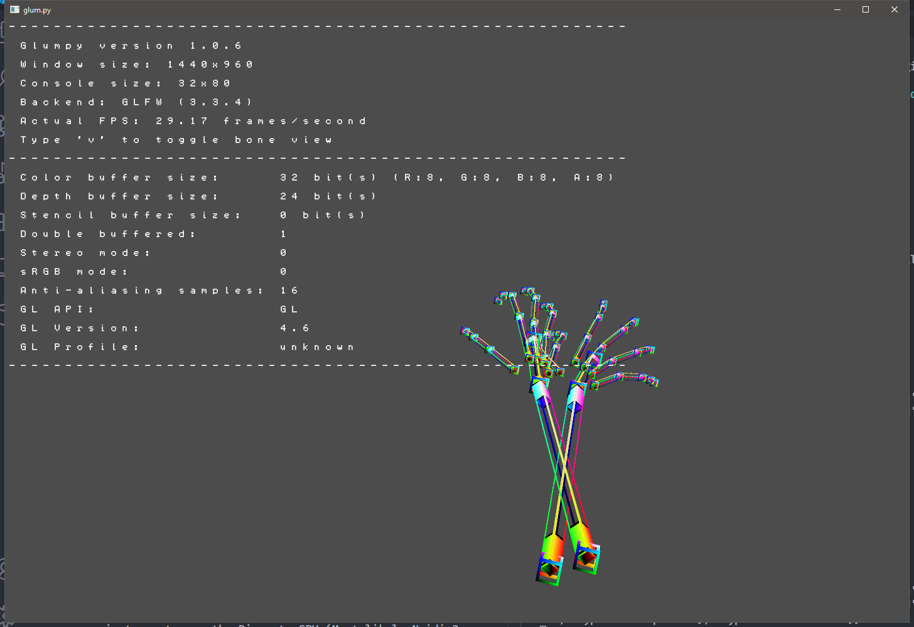

# Leap Motion Controller Python Driver


Based on `WebSocket`.

- `main.py`: contains the main funciton of the project, should be run with `python main.py`, spawns multiple threads
- `hand.py`: the main file of the driver, maps websocket json into human readable python objects
- `cube.py`: OpenGL program, used for rendering the hand on the screen, skip it if you don't want to see shaders
- `beacon.py`: the Serial (possibly via Bluetooth) communication manager, core is a PySerial object, can be disabled for debugging
- `log.py`: global logger, for a friendly debugging experience with time of the log can colors to identify the importance
- `utils.py`: not used in the main program, used for testing the serial connection, it just prints out every message it receives
- `helper.py`: some OpenGL styled transformation matrix, expanded on the `glm` package provieded by `glumpy`


## Quick Start

### Python Setup

First, you should have a `python 3` installation available, `conda` or just `python` with both work fine.

Then, install the required package listed in `requirements.txt` by:

```shell
pip install -r requirements.txt
```

For **Windows** user, the `glumpy` package need to be fixed to properly display fonts.

- Navigate to `<YOUR PYTHON ROOT>/lib/site-packages/glumpy/graphics/text/sdf_font.py`, line `45`
- Change both the `(ratio*ncols)` and `(ratio*nrows)` to `int(ratio*ncols)` and `int(ratio*nrows)`

For `python 3.8` or above, since `time.clock()` has been removed, you need to fix it in the `glumpy` installation.

- Navigate to `<YOUR PYTHON ROOT>/lib/site-packages/glumpy/app/clock.py`, line `164`.
- Change `time.clock` to `time.perf_counter`
- See this [issue](https://github.com/glumpy/glumpy/issues/254) for more information

### Leap Motion Setup

First you need to download the software development kit from **Leap Motion**'s [developer portal](https://developer.leapmotion.com/sdk-leap-motion-controller).

Then, buy a **Leap Motion Controller** and plug it in your system.

For your convenience, this is the [download link](https://www2.leapmotion.com/v4.1-lmc-windows-sdk) for the 4.1.0 **Windows** SDK.

- Install the SDK by double clicking the `.exe` file and click through

- After that if all went well you should see a green bar lying in your task bar (assume you're a **Windows** user)

  

- Click the green bar and you'll see some convenient information listed, some funny debugging tool. Play around if your like.

- Then, you need to check the **enable web app** checkbox in the settings or `glum.py` won't run.
  Since our driver is based on `WebSocket`

### Test `glum.py`

You can just run

```shell
python main.py
```

to see whether everything is working now.

Raise your hand above the Leap Motion Controller, to see some fingers rendered





Typically, you might encounter these problems:

1. `Cannot connect to WebSocket`
   This is caused by invalid SDK `WebSocket` version or not enabling web app in the **Leap Motion Controller Panel**.
   Try changing the URI presented in the `sample` function of the `glum.py` file. Try out `v6.json` or `v7.json`

2. `Low Frame Rate`, typically, `glum.py` should be able to run close to 60 FPS (at least above 40) on a discrete GPU.
   This might be caused by not enabling your python instance to use the Discrete GPU (Most likely Nvidia?).
   Go to **Nvidia Control Panel**, navigate to 3D settings, change per app settings and add your `python` to the list, then select `High Performance Processor`.
   This might also be caused by not installing a **good backend** for `glumpy`, install `glfw` by the following [link](https://www.glfw.org/download)
   Check this [link](https://glumpy.readthedocs.io/en/latest/installation.html#backends-requirements) for more information and for a step-by-step 64-bit **Windows** installation guide.

### Bluetooth to Serial Port

If you've got a Bluetooth to serial slave device on your Arduino or whatever, you can read on to try connecting to it directly. Otherwise jump to the next small section to see how to simulate the virtual port and test your output first.

Connect the Arduino **BT04** Bluetooth to serial device first:

- It's a little bit tricky but I believe you'll first try to search for the Bluetooth device with that default name (usually **BT04** or **BT06**)
- Connect to it using default PIN (you can change the PIN if you have direct serial access to the chip, but that won't be necessary): **1234**
- After that you'll be able to see some serial port pop out of your system
  - On **Windows**, check out the **Bluetooth serial device** in **Control Panel** for added **BT04 Outgoing Port**
  - On **\*nix**, `ls /dev/tty.*` for something containing **BT04**
- Note that the chip will declare connected once the **serial port** mentioned above is opened, not the **Bluetooth connection**. So you might still notice a blinking red light even if the pairing is successful

Now you're able to talk to the device using the port mentioned above.

### Virtual Serial Port Testing

This section will be helpful if you want to simulate a serial port interface and check out what you've passed on to the port.

On **Windows**, check out the **com0com** utility by googling it.

Set up the virtual ports and you can read stuff from it using `utils.py`

On **\*nix**, check out **`socat`**, you can install it using `sudo apt install socat` or `brew install socat`, create a pair of port on `/dev/master` and `/dev/slave` using:

```shell
socat -d -d pty,link=/dev/master,raw,echo=0 pty,link=/dev/slave,raw,echo=0
```

### Gesture Space to Voltage Space


